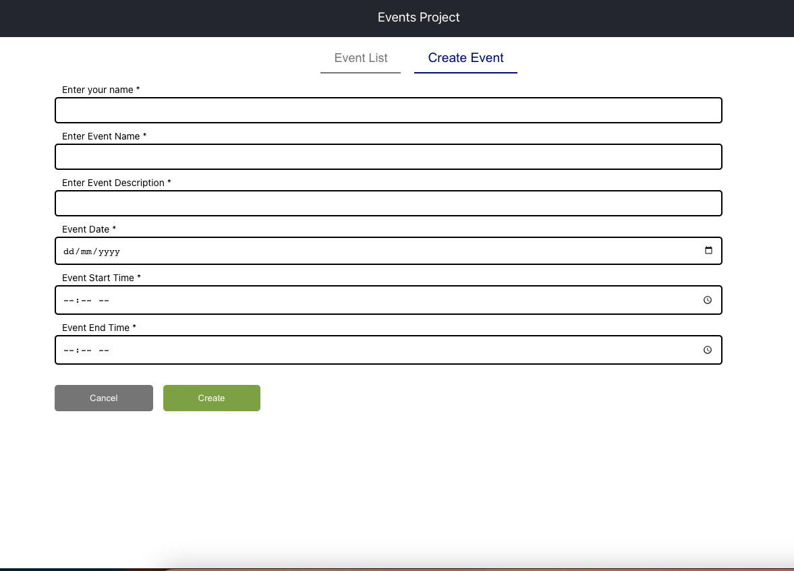
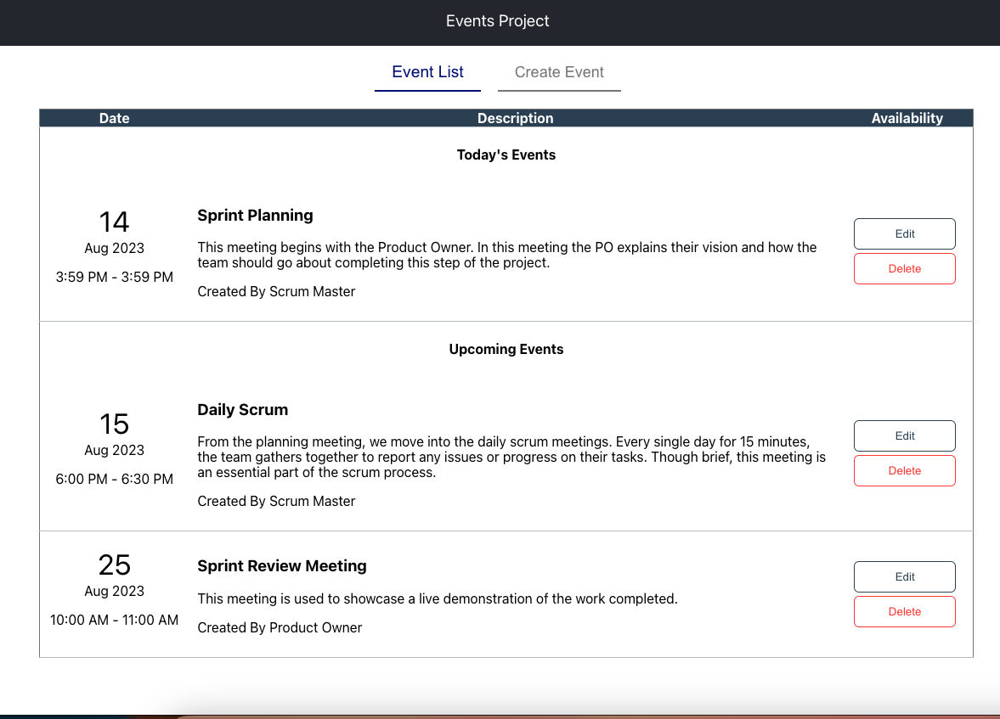
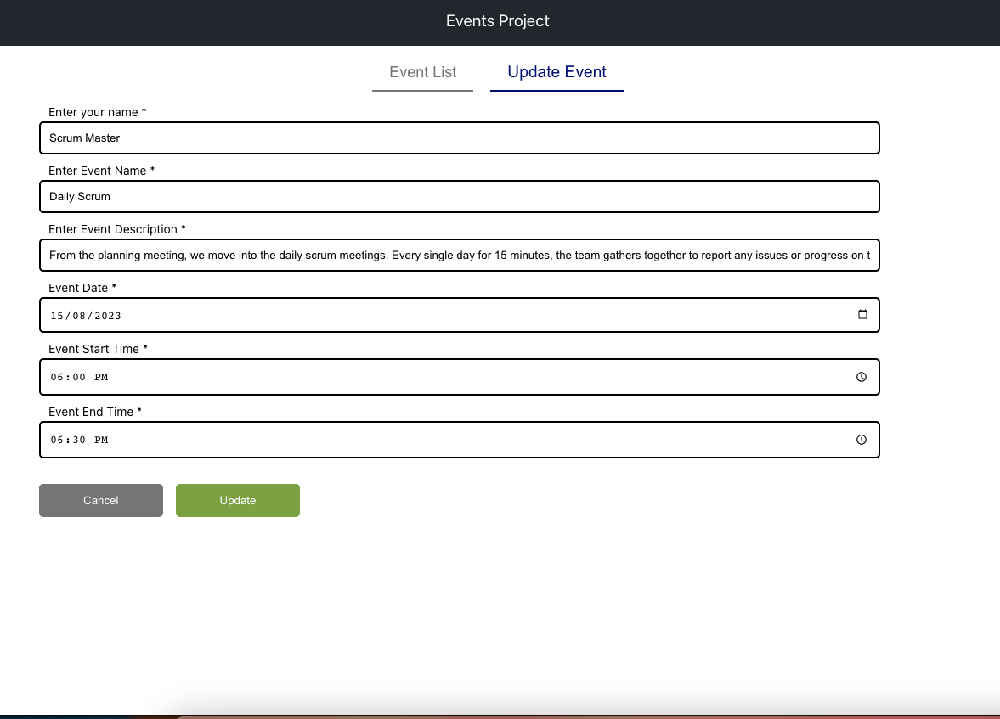

# Events Project

## The Application

Build an application to manage a user's tasks.

- Create, delete and edit a task
- List of today's and upcoming tasks, grouped by date and time

Task must contain the data below:

- User
- Date
- Start and end time
- Subject
- Description

## Project Overview
The project involved building a C# application to manage user tasks. The application required features like task creation, deletion, editing, and displaying a list of today's and upcoming tasks grouped by date and time. The project aimed to evaluate my coding skills, understanding of software architecture, and decision-making abilities.

## Tools Required.
Vs-Code or Visual Studio  to set up & run the project.

## How to run Project
Create `.Net Core`  swagger API & I had combined `react-application` into the API project. I had built & published the react project into the API. 

## To run .Netcore project
Run in Vs as a default browser.

## To run react project separately

`npm i`(to install the default packages)
`npm start`(to run the react UI aplication)

## Project Structure
`Event.Application` (It has Services,Repos,Interface & Models)

`Events.Api` (It has Controller,wwwroot which has build bundle of UI React packages)

`Events.Api.Test` (It has test cases for both pasitive & negative scenerios)

`Events.UI` (It has build,node_modules, public, & src-Components-create sepearate components for each module
-Service-create Api call function.

## Solution Overview
## Chosen Approach
For this project, I choose to use `ASP.NET Core` as the framework for building the back-end application. I opted for a layered architecture pattern to ensure separation of concerns and maintainability.

## Architecture Overview

## Presentation Layer: 
Implemented using ASP.NET Core controllers and views (Bonus: React for the frontend)

## Application Layer: 
Managed the business logic and orchestration of data between the presentation and domain layers.

## Domain Layer: 
Modeled the core domain entities like User and Task, as well as services for business logic.

## Data Layer:: In-memory database

## Tests: 
Implemented unit tests for critical parts of the application, focusing on business logic and data access.

## Code Structure
Organized the codebase into separate folders for each layer.
Utilized `dependency injection` to manage dependencies across layers.
Created clear and concise interfaces for services and repositories 
to promote loose coupling.

## UI Library: 
Chose React for the frontend due to its component-based architecture and reusability.

## Database: 
Opted for an in-memory `singleton class`  for the alternative database for simplicity and easy setup.

## HTTP/Caching: 
Implemented a basic caching mechanism using ASP.NET Core's built-in caching features.

## Form Validation: 
Implemented client-side and server-side form validation to ensure data integrity.

## Excellent OOP usage: Ensured clean type definitions, proper interfaces, and Singleton Class.
Implemented form input data control and validation to enhance user experience.
Maintained good code metrics and adhered to code formatting guidelines.

